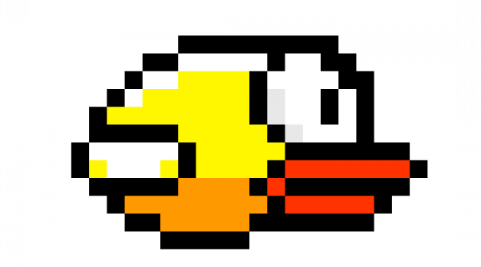

<div id="top"></div>

<!-- PROJECT SHIELDS -->
<!--
*** I'm using markdown "reference style" links for readability.
*** Reference links are enclosed in brackets [ ] instead of parentheses ( ).
*** See the bottom of this document for the declaration of the reference variables
*** for contributors-url, forks-url, etc. This is an optional, concise syntax you may use.
*** https://www.markdownguide.org/basic-syntax/#reference-style-links
-->

<!--[![Contributors][contributors-shield]][contributors-url]
[![Stargazers][stars-shield]][stars-url]-->
[![MIT License][license-shield]][license-url]
[![LinkedIn][linkedin-shield]][linkedin-url]

<!-- PROJECT LOGO -->
<br />
<div align="center">
  <a href="https://github.com/DorianFournier/Flappy-thon">
    
  </a>

  <h3 align="center">Flappy-Thon</h3>

  <p align="center">
    The new life of Flappy-Bird, coding with MicroPython !
    <br />
    <a href="https://github.com/DorianFournier/Flappy-thon"><strong>Explore the docs »</strong></a>
    <br />
    <br />
    <a href="#demo">View Demo</a>   
    ·
    <a href="https://github.com/DorianFournier/Flappy-thon/issues">Report Bug</a>
    ·
    <a href="https://github.com/DorianFournier/Flappy-thon/pulls">Request Feature</a>
  </p>
</div>


<!-- TABLE OF CONTENTS -->
<details>
  <summary>Table of Contents</summary>
  <ol>
    <li>
      <a href="#about-the-project">About The Project</a>
    </li>
    <li>
      <a href="#little-course-of-french">Little course of French</a>
    </li>
    <li>
      <a href="#getting-started">Getting Started</a>
      <ul>
        <li><a href="#clone-the-repository">Clone the repository</a></li>
        <li><a href="#prerequisites">Prerequisites</a></li>
        <li><a href="#flash-the-board">Flash the board</a></li>
          <ul>
            <li><a href="#download-the-flashing-program-and-firmware">Download the flashing program and Firmware</a></li>
            <li><a href="#use-a-virtual-environment">Use a virtual environment</a></li>
            <li><a href="#repl">REPL</a></li>
          </ul>
      </ul>
    </li>
    <li><a href="#sources">Sources</a></li>
    <li><a href="#license">License</a></li>
    <li><a href="#demo">Demo</a></li>
  </ol>
</details>


<!-- ABOUT THE PROJECT -->
## About The Project
<div align="center">
  </br>
  
  </br></br>
</div>

Yes you read right ! There is no mistake, it's no "Flappy Bird", but "Flappy-thon" in tribute to the fabulous programming language : Python (and also for the game).
You can read that 'Flap-python', but you'll understand why I split the name like that !


Development tools used :
* STM32F407DISC1 development card ⚠️ LIS3DSH NECESSARY (or you need to modify the code) ⚠️
* MicroPython
* Linux
* Visual Studio 
* Git and GitHub 🙂

<p align="right">(<a href="#top">back to top</a>)</p>


<!-- LITTLE COURSE OF FRENCH -->
## Little course of French

- How we say "Tuna fish" in French ? 
  - We say "Thon"

Here we go, after this unbelivable French course, you understand why the game name is "Flappy-Thon"


<p align="right">(<a href="#top">back to top</a>)</p>


<!-- GETTING STARTED -->
## Getting Started

If you are interested in this game, follow these steps to download all necessary dependencies !
(I explain how I do with an STM32F407G discovery board.)


<!-- CLONE THE REPOSITORY -->
### Clone the repository

_Don't forget to click the "star button"_

1. Clone the repo to your local computer
   ```sh
   git clone git@github.com:your_username/Flappy-thon.git
   ```
   or
   ```sh
   git clone https://github.com/your_username/Flappy-thon.git
   ```

<p align="right">(<a href="#top">back to top</a>)</p>


<!-- PREREQUISITES -->
### Prerequisites

First of all, you need to install microPython.
For it, go to this page : https://micropython.org/download/

In this same page, you'll find all the boards accepted by microPython, so check if one of this is disponible in your lab ! For the user interface I used an accelerometer (LIS3DSH present on the board), so if you don't want to modify the code, you must have the same accelerometer in the system. 🙂

(if you're a crazy developer, I'm sorry but I will not explain the next steps for """windows lovers""".)


<!-- FLASH THE BOARD -->
### Flash the board

Personnaly, I worked on an STM32F407G DISC1 board for this project, and I flashed the board with DFU. You can also use the classic ST-LINK for STBoard (https://micropython.org/download/STM32F4DISC/).

For this board, you need to connect VDD and BOOT pins with a jumper, and use a mini USB cable for the card alimentation, and a micro USB cable for the flashing part.


#### Download the flashing program and Firmware

- pydfu.py file : https://github.com/micropython/micropython/blob/master/tools/pydfu.py
- firmware : https://micropython.org/download/STM32F4DISC/ (at the bottom of this page)


#### Use a virtual environment

Activate a virtual environment with the command :
```sh
source venv/bin/activate
```

_Don't forget to connect the board_

Returns a list of USB devices which are currently in DFU mode :
```sh
python pydfu.py --list
```

Flash the board:
```sh
python pydfu.py --upload [_name_of_the_firmware_download_before_].dfu
```

Exemple of result (file name depends of the choosen firmware):
```sh
File: STM32F4DISC-20220117-v1.18.dfu
...
...
Zxiting DFU...
Finished
```

Now, you can start a microPython terminal :
```sh
sudo screen /dev/ttyACM0
```
The REPL mode is launched...

<p align="right">(<a href="#top">back to top</a>)</p>


#### REPL

To start the program, import the file "flappython.py".

```py
>>> import flappython
```

<p align="right">(<a href="#top">back to top</a>)</p>


#### Tool file

You can use tool file for copying and umount correctly the board before test it.
```sh
sudo bash cp_project.sh
```
<p align="right">(<a href="#top">back to top</a>)</p>


<!-- SOURCES -->
## Sources
- Official documentation for microPython : https://docs.micropython.org/en/latest/index.html
- GitHub microPython :https://github.com/micropython/micropython

<p align="right">(<a href="#top">back to top</a>)</p>


<!-- LICENSE -->
## License

Distributed under the MIT License. See `LICENSE.txt` for more information.

<p align="right">(<a href="#top">back to top</a>)</p>


<!-- ACKNOWLEDGMENTS -->
## Demo

https://user-images.githubusercontent.com/54947603/166462824-3a0d768c-3650-460f-be0c-68dacfa28426.mp4


<p align="right">(<a href="#top">back to top</a>)</p>


<!-- MARKDOWN LINKS & IMAGES -->
<!-- https://www.markdownguide.org/basic-syntax/#reference-style-links -->
[contributors-shield]: https://img.shields.io/github/contributors/othneildrew/Best-README-Template.svg?style=for-the-badge
[contributors-url]: https://github.com/othneildrew/Best-README-Template/graphs/contributors
[stars-shield]: https://img.shields.io/github/stars/othneildrew/Best-README-Template.svg?style=for-the-badge
[stars-url]: https://github.com/DorianFournier/Flappy-thon/stargazers
[license-shield]: https://img.shields.io/github/license/othneildrew/Best-README-Template.svg?style=for-the-badge
[license-url]: https://github.com/othneildrew/Best-README-Template/blob/master/LICENSE.txt
[linkedin-shield]: https://img.shields.io/badge/-LinkedIn-black.svg?style=for-the-badge&logo=linkedin&colorB=555
[linkedin-url]: https://www.linkedin.com/in/dorian-fournier/
